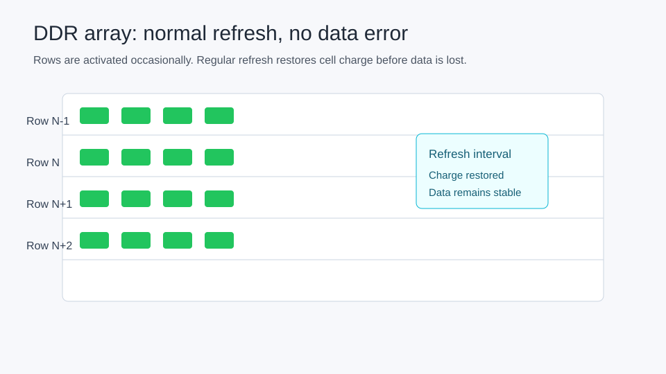
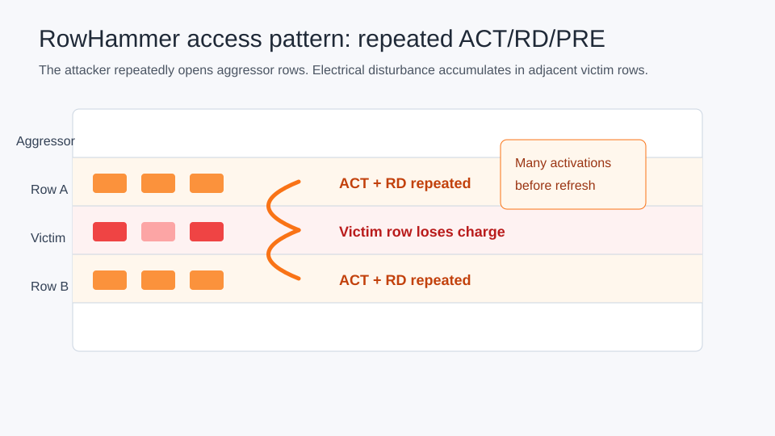
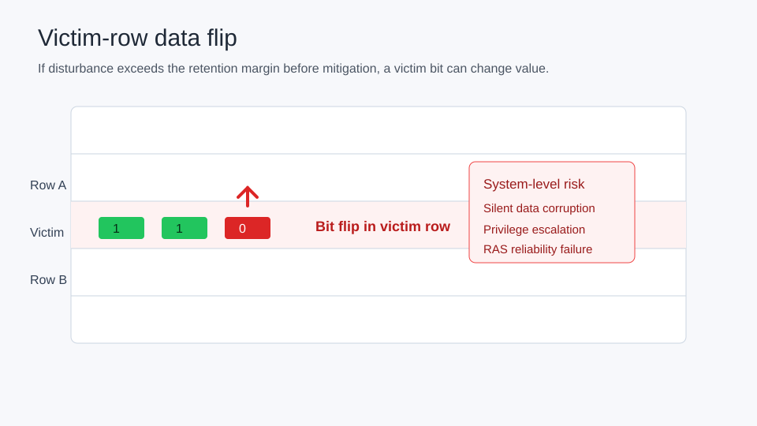

# RowHammer Demo Results And Analysis

This note summarizes the standalone RowHammer demo results for three
configurations:

- DDR4-2400R
- DDR4-3200AA
- DDR5-3200BN

Each run uses a 10,000-read hammer trace that alternates between two rows in
the same rank and bank.

## One-Command Reproduction

Run:

```bash
bash script/run_rowhammer_compare_10000.sh
```

The script generates temporary traces and configs under:

```text
ramulator_out/compare_10000/
```

It writes:

```text
ramulator_out/compare_10000/summary.csv
ramulator_out/compare_10000/summary.md
```

## Result Table

| Config | DRAM model | Mitigation model | Reads | ACT | PRE | REFab | VRR | RFM/DRFM | Cycles | Finding |
| --- | --- | --- | --- | --- | --- | --- | --- | --- | --- | --- |
| DDR4-2400R | DDR4-VRR | OracleRH tRH=4 | 10000 | 9999 | 8952 | 2134 | 2135 | 0 | 9999000 | VRR triggered |
| DDR4-3200AA | DDR4-VRR | OracleRH tRH=4 | 10000 | 9999 | 9197 | 1602 | 1602 | 0 | 9999000 | VRR triggered |
| DDR5-3200BN | DDR5 | Command count only | 10000 | 9999 | 8431 | 3214 | 0 | 0 | 9999000 | RFM/DRFM not issued |

## How To Read The Table

`Reads` is the number of load requests injected by the trace.

`ACT` is the number of row activations. RowHammer is fundamentally about too
many activations to aggressor rows in a refresh window.

`PRE` is the number of precharge commands. The alternating-row trace causes
row conflicts, so the controller must close one row before opening another row
in the same bank.

`REFab` is normal all-bank refresh.

`VRR` is victim-row refresh. In this demo, `VRR > 0` means the DDR4 RowHammer
mitigation path was triggered.

`RFM/DRFM` is the sum of DDR5 `RFMab`, `RFMsb`, `DRFMab`, and `DRFMsb`.

## Main Findings

1. DDR4-2400R and DDR4-3200AA both trigger RowHammer mitigation.

   The `OracleRH` plugin tracks row activations. When a row reaches `tRH: 4`,
   it injects a `victim-row-refresh` request. In the `DDR4-VRR` model, that
   request becomes a `VRR` command.

2. DDR4-2400R issues more `VRR` commands than DDR4-3200AA in this fixed
   10,000-read run.

   Observed:

   ```text
   DDR4-2400R  VRR = 2135
   DDR4-3200AA VRR = 1602
   ```

   This does not mean DDR4-2400 is universally less safe. It means that under
   this particular trace, scheduler behavior, timing preset, and fixed
   simulation window, more mitigation commands were issued in the DDR4-2400R
   case.

3. DDR5-3200BN shows the same hammer-style command pressure but no automatic
   RFM mitigation in this source tree.

   Observed:

   ```text
   DDR5-3200BN ACT = 9999
   DDR5-3200BN RFM/DRFM = 0
   ```

   The pinned Ramulator2 DDR5 model includes RFM and DRFM commands and timing,
   but the included RowHammer mitigation plugins are `VRR`-oriented. They do
   not automatically issue DDR5 RFM commands.

4. This is a command-level mitigation demo, not a physical bit-flip model.

   The simulator shows activations, refreshes, and mitigation commands. It does
   not currently model charge leakage, actual data corruption, or DDR5 on-die
   ECC correction behavior.

## DDR5RFM Plugin Extension

After adding the `DDR5RFM` plugin, the 10,000-read comparison includes a DDR5
mitigation row:

| Config | DRAM model | Mitigation model | Reads | ACT | PRE | REFab | VRR | RFM/DRFM | Cycles | Finding |
| --- | --- | --- | --- | --- | --- | --- | --- | --- | --- | --- |
| DDR5-3200BN-RFM | DDR5 | DDR5RFM tRH=4 directed-rfm | 10000 | 9999 | 8431 | 3214 | 0 | 357 | 9999000 | RFM/DRFM issued |

This confirms that the simulator can now demonstrate a DDR5 command-level
RowHammer mitigation path. The default plugin configuration issues
`directed-rfm`, which maps to the DDR5 `DRFMab` command.

## Address Mapping Note

The DDR4 and DDR5 traces use different second addresses so both traces hammer
two rows in the same rank and bank.

DDR4 trace pattern:

```text
LD 0x0
LD 0x40000
```

DDR5 trace pattern:

```text
LD 0x0
LD 0x20000
```

The difference comes from the selected organizations and the `RoBaRaCoCh`
mapper. With `rank: 2`, the row bit lands at a different address position in
the DDR5 configuration.

## Visual Explanation

These three diagrams provide a simple visual story for a demo deck.

Normal DDR state:



Hammering one or two aggressor rows:



Victim-row bit flip:



## Phase 3 Video Direction

The final video should show the problem and mitigation evolution in this order:

1. DRAM rows store charge in cells.
2. Repeated activation of aggressor rows disturbs nearby victim rows.
3. In DDR3/DDR4 timing windows, enough activations before refresh can create a
   bit flip.
4. DDR4-era mitigations such as TRR-like tracking or victim-row refresh reduce
   risk by refreshing neighbors.
5. DDR5 adds standardized refresh-management command support such as RFM and
   DRFM, and commodity DDR5 devices also commonly include on-die ECC.
6. This Ramulator2 demo currently shows DDR4 `VRR` mitigation and DDR5
   command-level RFM availability, but not an on-die ECC fault-correction
   model.

A first MP4 demo video is available here:

```text
docs/videos/rowhammer_ras_demo.mp4
```

Regenerate it with:

```bash
bash script/make_rowhammer_ras_video.sh
```

The video is intentionally concise and uses static vector-style scenes. The
next quality step is adding animation for command flow, activation counters,
and refresh-window timing.
